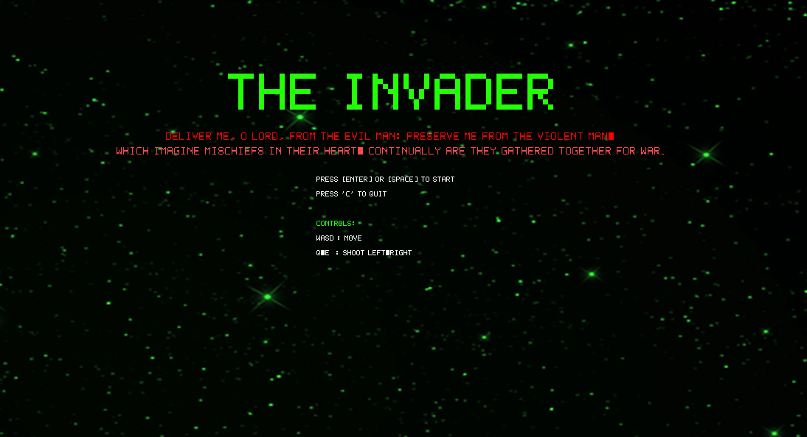
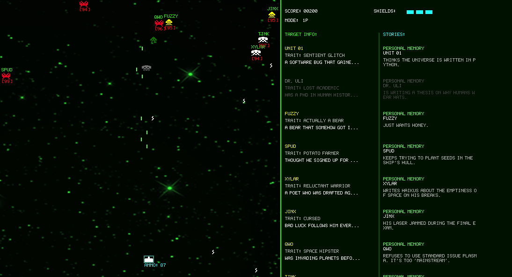
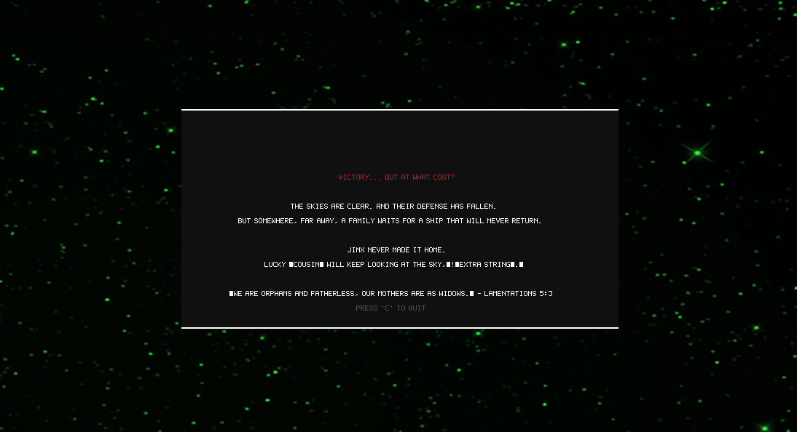
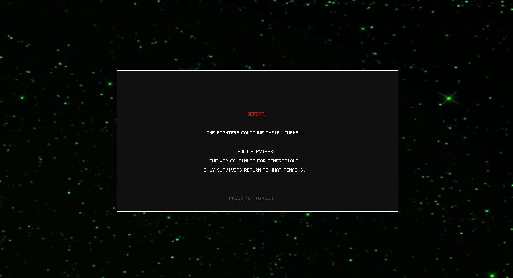

# The Invader

> *"Then said Jesus unto him, Put up again thy sword into his place: for all they that take the sword shall perish with the sword."* — **Matthew 26:52**

## Screenshots

<video src="screenshots/gameplay.mov" width="100%" controls autoplay loop muted></video>









> [!NOTE]
> This project is an enhanced fork of [sausheong/invaders](https://github.com/sausheong/invaders). It introduces advanced behavioral logic, expanded narrative elements, and a refined visual aesthetic.

---

## Overview
**The Invader** is a tactical reimagining of the classic Space Invaders genre, focusing on the psychological impact of conflict. Rather than facing anonymous targets, players engage with uniquely identified entities, each possessing a distinct background and behavioral profile.

## Core Features

### Advanced Behavioral Engine
The game utilizes a sophisticated rule-based logic system to drive entity behavior. 
- **Dynamic Evasion**: Entities proactively dodge incoming projectiles based on real-time trajectory analysis.
- **Specialized Profiles**: Each entity operates under a unique tactical profile, such as *Sniper*, *Berserker*, or *Stalker*, ensuring varied and challenging encounters.
- **Autonomous Mode**: An integrated automated system capable of demonstrating high-precision gameplay.

### Narrative Depth
- **Rich Biographical Data**: Every entity is backed by a dynamically loaded biography, including family ties and personal histories.
- **Outcome-Based Narratives**: Post-game summaries are generated based on survival statistics, providing a detailed reflection on the consequences of the engagement.

### Visual & Technical Enhancements
- **Refined Aesthetics**: A customized Matrix-inspired visual filter optimized for terminal-based rendering.
- **Dual-Projectile System**: Concurrent projectile handling for enhanced tactical freedom.
- **Shield Mechanics**: Multilayered defensive system allowing for strategic error correction.

## Controls
| Input | Action |
|-------|--------|
| **W/A/S/D** | Multidirectional Movement |
| **Q / E** | Activate Primary/Secondary Projectile Launchers |
| **Space / Enter** | System Initialization / Selection Confirmation |
| **P** | System Pause |
| **C** | Session Termination (Requires Verification) |

## System Requirements & Installation
### Prerequisites
- **Terminal Emulator**:
  - **macOS**: iTerm2 (recommended for best graphics), Terminal.app (ANSI fallback)
  - **Linux**: Any terminal emulator (GNOME Terminal, xterm, etc.)
  - Best experience with Sixel-capable terminals like mlterm, foot, or WezTerm
- **Go 1.23+**

### Installation
```bash
./build.sh
./game
```

